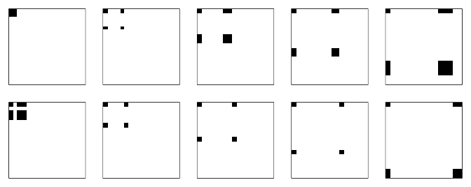
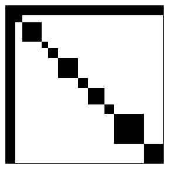

psqn: Partially Separable Quasi-Newton
================

<style>
img {
    border: none;
}
</style>

  
}
\\def\\Cond#1#2{\\left(#1\\,\\middle|\\, #2\\right)}
\\def\\mat#1{\\boldsymbol{#1}}
\\def\\der{{\\mathop{}\\!\\mathrm{d}}}
\\def\\argmax{\\text{arg}\\,\\text{max}}
\\def\\Prob{\\text{P}}
\\def\\diag{\\text{diag}}
")  

This package provides an optimization method for *partially separable*
functions. Partially separable functions are of the following form:

  
 = \\sum_{i = 1}^n f_i(\\vec x_{\\mathcal I_i}) 
")  

where ,

  
\\vec x, \\qquad 
  \\mathcal I_i = (j_{i1}, \\dots, \\mathcal j_{im_i}) \\in 
  \\{1, \\dots l\\}^l,
")  
and  is the
’th
column of the

dimensional identity matrix. Each function

is called an *element function* and only depends on  parameters. This allows for an efficient quasi-Newton
method when all the
’s are much smaller than the dimension of the parameter vector
, . The framework can be extended to allow for a linear combination of

parameters but we do not cover such problems. TODO: add reference.

We only consider a more restricted form of the problem. Assume that each
index set  is of the form

  
  

That is, each index set contains

*global parameters* and  *private parameters* which are
particular for each element function,
. For implementation reason, we let

  
  

such that the element function’s private parameters lies in consecutive
part.

## Example

We are going to consider a Taylor approximation for a generalized linear
mixed model. In particular, we focus on a mixed logit regression where

  
}(\\vec 0, \\mat\\Sigma) \\\\
\\vec\\eta_i &= \\mat X_i\\top\\vec\\beta + \\mat Z_i\\vec U_i \\\\
Y_{ij} &\\sim \\text{Bin}(\\text{logit}^{-1}(\\eta_{ij}), 1), 
\\qquad j = 1, \\dots, t_i
\\end{align*}
")  

where
}(\\vec\\mu,\\mat\\Sigma)") means a
-dimensional a multivariate normal distribution with mean
 and covariance matrix
 and ") means a binomial distribution probability
 and
size .
 is an unknown random effect with an unknown covariance
 and
 is an unknown fixed effect vector.
 and  are known design matrices each with

rows for each of the

observed outcomes.

As part of a Taylor approximation, we find a mode of ")
of the log of the integrand given a covariance matrix estimate,
. That is, we are minimizing

  
![
\\begin{align\*}
f(\\vec x) &= -\\sum\_{i = 1}^n \\left(
\\sum\_{k = 1}^{t\_i}(y\_{ij}\\eta\_{ij} - \\log(1 + \\exp\\eta\_{ij}))
\- \\frac 12 \\widehat{\\vec u}\_i^\\top\\widehat{\\mat \\Sigma}^{-1}
\\widehat{\\vec u}\_i
\\right) \\\\
&= -\\sum\_{i = 1}^n \\left(
\\vec y\_i(\\mat X\_i\\vec\\beta + \\mat Z\_i\\widehat{\\vec u}\_i)
\- \\sum\_{k = 1}^{t\_i}
\\log(1 + \\exp(\\vec x\_{ik}^\\top\\vec\\beta + \\vec
z\_{ik}^\\top\\widehat{\\vec u}\_i))
\- \\frac 12 \\widehat{\\vec u}\_i^\\top\\widehat{\\mat \\Sigma}^{-1}
\\widehat{\\vec u}\_i
\\right) \\\\
&= \\sum\_{i = 1}^nf\_i((\\vec\\beta^\\top, \\widehat{\\vec
u}\_i^\\top)) \\\\
f\_i((\\vec\\beta^\\top, \\vec u^\\top)) &= 
\-\\vec y\_i(\\mat X\_i\\vec\\beta + \\mat Z\_i\\vec u)
\+ \\sum\_{k = 1}^{t\_i}
\\log(1 + \\exp(\\vec x\_{ik}^\\top\\vec\\beta + \\vec
z\_{ik}^\\top\\vec u))
\+ \\frac 12 \\vec u^\\top\\widehat{\\mat \\Sigma}^{-1} \\vec u
\\end{align\*}
](https://render.githubusercontent.com/render/math?math=%0A%5Cbegin%7Balign%2A%7D%0Af%28%5Cvec%20x%29%20%26%3D%20-%5Csum_%7Bi%20%3D%201%7D%5En%20%5Cleft%28%0A%20%20%5Csum_%7Bk%20%3D%201%7D%5E%7Bt_i%7D%28y_%7Bij%7D%5Ceta_%7Bij%7D%20-%20%5Clog%281%20%2B%20%5Cexp%5Ceta_%7Bij%7D%29%29%0A%20%20-%20%5Cfrac%2012%20%5Cwidehat%7B%5Cvec%20u%7D_i%5E%5Ctop%5Cwidehat%7B%5Cmat%20%5CSigma%7D%5E%7B-1%7D%20%5Cwidehat%7B%5Cvec%20u%7D_i%0A%20%20%5Cright%29%20%5C%5C%0A%26%3D%20-%5Csum_%7Bi%20%3D%201%7D%5En%20%5Cleft%28%0A%20%20%5Cvec%20y_i%28%5Cmat%20X_i%5Cvec%5Cbeta%20%2B%20%5Cmat%20Z_i%5Cwidehat%7B%5Cvec%20u%7D_i%29%0A%20%20-%20%5Csum_%7Bk%20%3D%201%7D%5E%7Bt_i%7D%0A%20%20%5Clog%281%20%2B%20%5Cexp%28%5Cvec%20x_%7Bik%7D%5E%5Ctop%5Cvec%5Cbeta%20%2B%20%5Cvec%20z_%7Bik%7D%5E%5Ctop%5Cwidehat%7B%5Cvec%20u%7D_i%29%29%0A%20%20-%20%5Cfrac%2012%20%5Cwidehat%7B%5Cvec%20u%7D_i%5E%5Ctop%5Cwidehat%7B%5Cmat%20%5CSigma%7D%5E%7B-1%7D%20%5Cwidehat%7B%5Cvec%20u%7D_i%0A%20%20%5Cright%29%20%5C%5C%0A%26%3D%20%5Csum_%7Bi%20%3D%201%7D%5Enf_i%28%28%5Cvec%5Cbeta%5E%5Ctop%2C%20%5Cwidehat%7B%5Cvec%20u%7D_i%5E%5Ctop%29%29%20%5C%5C%0Af_i%28%28%5Cvec%5Cbeta%5E%5Ctop%2C%20%5Cvec%20u%5E%5Ctop%29%29%20%26%3D%20%0A%20%20-%5Cvec%20y_i%28%5Cmat%20X_i%5Cvec%5Cbeta%20%2B%20%5Cmat%20Z_i%5Cvec%20u%29%0A%20%20%2B%20%5Csum_%7Bk%20%3D%201%7D%5E%7Bt_i%7D%0A%20%20%5Clog%281%20%2B%20%5Cexp%28%5Cvec%20x_%7Bik%7D%5E%5Ctop%5Cvec%5Cbeta%20%2B%20%5Cvec%20z_%7Bik%7D%5E%5Ctop%5Cvec%20u%29%29%0A%20%20%2B%20%5Cfrac%2012%20%5Cvec%20u%5E%5Ctop%5Cwidehat%7B%5Cmat%20%5CSigma%7D%5E%7B-1%7D%20%5Cvec%20u%0A%5Cend%7Balign%2A%7D%0A
"
\\begin{align*}
f(\\vec x) &= -\\sum_{i = 1}^n \\left(
  \\sum_{k = 1}^{t_i}(y_{ij}\\eta_{ij} - \\log(1 + \\exp\\eta_{ij}))
  - \\frac 12 \\widehat{\\vec u}_i^\\top\\widehat{\\mat \\Sigma}^{-1} \\widehat{\\vec u}_i
  \\right) \\\\
&= -\\sum_{i = 1}^n \\left(
  \\vec y_i(\\mat X_i\\vec\\beta + \\mat Z_i\\widehat{\\vec u}_i)
  - \\sum_{k = 1}^{t_i}
  \\log(1 + \\exp(\\vec x_{ik}^\\top\\vec\\beta + \\vec z_{ik}^\\top\\widehat{\\vec u}_i))
  - \\frac 12 \\widehat{\\vec u}_i^\\top\\widehat{\\mat \\Sigma}^{-1} \\widehat{\\vec u}_i
  \\right) \\\\
&= \\sum_{i = 1}^nf_i((\\vec\\beta^\\top, \\widehat{\\vec u}_i^\\top)) \\\\
f_i((\\vec\\beta^\\top, \\vec u^\\top)) &= 
  -\\vec y_i(\\mat X_i\\vec\\beta + \\mat Z_i\\vec u)
  + \\sum_{k = 1}^{t_i}
  \\log(1 + \\exp(\\vec x_{ik}^\\top\\vec\\beta + \\vec z_{ik}^\\top\\vec u))
  + \\frac 12 \\vec u^\\top\\widehat{\\mat \\Sigma}^{-1} \\vec u
\\end{align*}
")  

In this problem,
 is the shared parameters and the ’s are the private parameters. Thus, .

### Variational Approximation

TODO: write about variational approximations.

## Quasi-Newton Method for Partially Separable Functions

We are going to assume some prior knowledge of Newton’s method and the
Broyden–Fletcher–Goldfarb–Shanno (BFGS) algorithm and we only provide a
few details of these methods. However, will need a bit of notations from
these methods to motivate the quasi-Newton method we have implemented.

Newton’s method to minimize a function is to start at some value . Then we set  and

1.  compute a direction  given by   
    \\vec p_k = - \\nabla f(\\vec x_{k -1}),")  
2.  set  or  for ![\\gamma \\in
    (0, 1\]](https://render.githubusercontent.com/render/math?math=%5Cgamma%20%5Cin%20%280%2C%201%5D
    "\\gamma \\in (0, 1]") set to satisfy the [Wolfe
    conditions](https://en.wikipedia.org/wiki/Wolfe_conditions), and
3.  repeat with  if a convergence criterion is not satisfied.

Computing the Hessian, "), at every iteration can be expensive.
The BFGS algorithm offers an alternative where we use an approximation
instead. Here we start with some Hessian approximation  and

1.  compute a direction  given by   
    ,")  
2.  find a step size
     such that  satisfy the [Wolfe
    conditions](https://en.wikipedia.org/wiki/Wolfe_conditions),
3.  set , ,
     - \\nabla f(\\vec x_{k - 1})"),
4.  perform a rank-two update   
      
        and
5.  repeat with  if a convergence criterion is not satisfied.

This reduces the cost of computing the Hessian. Further, we can update
 to avoid solving "). The matrix
 will still be large and dense when
 is
large.

### Using Partial Separability

As an alternative, we can exploit the structure of the problem we are
solving. Let

  

")  

The true Hessian in our case is sparse and given by

  
 = \\sum_{i = 1}^n 
  \\mat H_i^\\top\\nabla^2f_i(\\vec x_{\\mathcal I_i})\\mat H_i
")  

Notice that each ") is only a \\times (p + q_i)") matrix. We illustrate this below with  element functions. Each plot is \\mat H_i") where
black entries are a
non-zero.



The whole Hessian
is:



We can use the partial separability to implement a BFGS method where we
make 
BFGS approximations, one for each element function,
. Let  be the approximation of ") at iteration
. Then
the method we have implemented starts with  and

1.  computes a direction  given by   
    \\vec p_k = - \\nabla f(\\vec x_{k -1}),")  
2.  finds a step size
     such that  satisfy the [Wolfe
    conditions](https://en.wikipedia.org/wiki/Wolfe_conditions),
3.  sets ,
4.  performs BFGS updates for each , and
5.  repeats with  if a convergence criterion is not satisfied.

This seems as if it is going to be much slower as we are solving a large
linear system if
 is
large. However, we can use the conjugate gradient method we describe in
the next section. This will be fast if we can perform the following
matrix-vector product fast:

  
\\vec z.
")  

To elaborate on this, each  consists of
matrix-vector product with a  symmetric matrix and a vector where "). This can be done in ") flops. Thus, the total cost is ") flops. This is in contrast to the
original ") flops with the BFGS method.

As an example suppose that  for all

element functions, , and . Then  and the matrix-vector product above requires  = 1200000") flops. In contrast  and the matrix-vector product in the
BFGS method requires  = 625525110") flops. That is 521 times more flops.
Similar ratios are shown in the [BFGS and Partially Separable
Quasi-Newton](#bfgs-and-partially-separable-quasi-newton) section.

More formerly, the former is ^2)") where  whereas the
matrix-vector product in the BFGS method is ^2)"). Further, the rank-two BFGS
updates are cheaper. However, we should keep in mind that the original
BFGS method yields an approximation of . Thus, we do not need to solve a linear system.

## Conjugate Gradient Method

The conjugate gradient method we use solve

  
  

which in our quasi-Newton method is

  
\\vec p_k = - \\nabla f(\\vec x_{k -1})")  

We start of with some initial value . Then we set , , , and:

1.  find the step length   
      
2.  find the new value   
      
3.  find the new residual   
      
4.  set ^{-1}\\vec r_{k + 1}^\\top\\vec r_{k + 1}"),
5.  set the new search direction to   
      
        and
6.  stop if  is smaller. Otherwise set
     and repeat.

The main issue is the matrix-vector product  but as we argued in the previous section that this
can be computed in ^2)") time.

## Line Search and Wolfe Condition

TODO: write this section.

## Symmetric Rank-one Updates

TODO: write this section.

## Example Using the Implementation

``` r
# assign model parameters and number of random effects and fixed effects
q <- 4
p <- 5
beta <- sqrt((1:p) / sum(1:p))
Sigma <- diag(q)

# simulate data set
n_clusters <- 400L
set.seed(66608927)

sim_dat <- replicate(n_clusters, {
  n_members <- sample.int(20L, 1L) + 2L
  X <- matrix(runif(p * n_members, -sqrt(6 / 2), sqrt(6 / 2)), 
              p)
  u <- drop(rnorm(q) %*% chol(Sigma))
  Z <- matrix(runif(q * n_members, -sqrt(6 / 2 / q), sqrt(6 / 2 / q)), 
              q)
  eta <- drop(beta %*% X + u %*% Z)
  y <- as.numeric((1 + exp(-eta))^(-1) > runif(n_members))
  
  list(X = X, Z = Z, y = y, u = u, Sigma_inv = solve(Sigma))
}, simplify = FALSE)

# example of the first cluster
sim_dat[[1L]]
#> $X
#>         [,1]   [,2]    [,3]
#> [1,]  0.0416 -0.809 -0.1839
#> [2,]  0.6524 -1.373 -0.9254
#> [3,] -1.3339 -0.957 -0.8708
#> [4,]  0.7547 -0.156  0.0178
#> [5,]  0.7191 -0.681 -0.7232
#> 
#> $Z
#>        [,1]   [,2]   [,3]
#> [1,]  0.167 -0.483 -0.785
#> [2,] -0.266 -0.823  0.794
#> [3,]  0.609 -0.549  0.269
#> [4,] -0.414 -0.457  0.605
#> 
#> $y
#> [1] 0 0 0
#> 
#> $u
#> [1]  0.0705 -1.7285  0.1538 -0.3245
#> 
#> $Sigma_inv
#>      [,1] [,2] [,3] [,4]
#> [1,]    1    0    0    0
#> [2,]    0    1    0    0
#> [3,]    0    0    1    0
#> [4,]    0    0    0    1
```

The combined vector with global and private parameters can be created
like this (it is a misnoma to call this `true_params` as the modes of
the random effects, the private parameters, should only match the random
effects if the clusters are very large):

``` r
true_params <- c(beta, sapply(sim_dat, function(x) x$u))

# global parameters
true_params[1:p]
#> [1] 0.258 0.365 0.447 0.516 0.577

# some of the private parameters
true_params[1:(4 *q) + p]
#>  [1]  0.0705 -1.7285  0.1538 -0.3245  0.2516 -0.5419 -0.5537 -0.2805 -1.1777 -1.7539  1.7338  0.5616 -0.8379  1.2412 -1.2046  1.4547
```

As a reference, we will create the following function to evaluate the
log of the integrand:

``` r
eval_integrand <- function(par){
  out <- 0.
  inc <- p
  beta <- par[1:p]
  for(i in seq_along(sim_dat)){
    dat <- sim_dat[[i]]
    X <- dat$X
    Z <- dat$Z
    y <- dat$y
    Sigma_inv <- dat$Sigma_inv
    
    u <- par[1:q + inc]
    inc <- inc + q
    eta <- drop(beta %*% X + u %*% Z)
    
    out <- out - drop(y %*% eta) + sum(log(1 + exp(eta))) + 
      .5 * drop(u %*% Sigma_inv %*% u)
  }
  
  out
}

# check the log integrand at true global parameters and the random effects
eval_integrand(true_params)
#> [1] 3511
```

### R Implementation

TODO: write this section.

### C++ Implementation

We provide a C++ implementation with the package. This can be found by
calling `system.file("mlogit-ex.cpp", package = "psqn")`. The content of
the file is:

``` cpp
// [[Rcpp::depends(psqn)]]
#include "psqn.h"

// we use RcppArmadillo to simplify the code
// [[Rcpp::depends(RcppArmadillo)]]
#include <RcppArmadillo.h>

using namespace Rcpp;

/// simple function to avoid copying a vector. You can ignore this.
inline arma::vec vec_no_cp(double const * x, size_t const n_ele){
  return arma::vec(const_cast<double *>(x), n_ele, false);
}

/***
 implements the element function for a given cluster. The class must provide
 the member functions which we provide here.

 We do not need to inherit from the element_function class but we can do it
 to ensure that we have implemented all the member functions.
 */
class m_logit_func final : public PSQN::element_function {
  /// design matrices
  arma::mat const X, Z;
  /// outcomes
  arma::vec const y;
  /// inverse covariance matrix
  arma::mat const Sigma_inv;

public:
  m_logit_func(List data):
  X        (as<arma::mat>(data["X"        ])),
  Z        (as<arma::mat>(data["Z"        ])),
  y        (as<arma::vec>(data["y"        ])),
  Sigma_inv(as<arma::mat>(data["Sigma_inv"])) { }

  /// dimension of the global parameters
  size_t shared_dim() const {
    return X.n_rows;
  }
  /// dimension of the private parameters
  size_t own_dim() const {
    return Z.n_rows;
  }

  /***
   computes the element function.
   @param point point to compute function at.
   */
  double func(double const *point) const {
    arma::vec const beta = vec_no_cp(point           , X.n_rows),
                       u = vec_no_cp(point + X.n_rows, Z.n_rows),
                     eta = X.t() * beta + Z.t() * u;

    double out(0);
    for(size_t i = 0; i < y.n_elem; ++i)
      out -= y[i] * eta[i] - log(1 + exp(eta[i]));

    out += arma::as_scalar(u.t() * Sigma_inv * u) * .5;

    return out;
  }

  /***
   computes the element function and its gradient.
   @param point point to compute function at.
   @param gr gradient vector with respect to global and private parameters.
   */
  double grad
    (double const * __restrict__ point, double * __restrict__ gr) const {
    arma::vec const beta = vec_no_cp(point           , X.n_rows),
                       u = vec_no_cp(point + X.n_rows, Z.n_rows),
                     eta = X.t() * beta + Z.t() * u;

    // create objects to write to for the gradient
    std::fill(gr, gr + beta.n_elem + u.n_elem, 0.);
    arma::vec dbeta(gr              , beta.n_elem, false),
              du   (gr + beta.n_elem, u.n_elem   , false);

    double out(0);
    for(size_t i = 0; i < y.n_elem; ++i){
      double const exp_eta = exp(eta[i]),
                   d_eta   = y[i] - exp_eta / (1 + exp_eta);
      out -= y[i] * eta[i] - log(1 + exp_eta);
      dbeta -= d_eta * X.col(i);
      du    -= d_eta * Z.col(i);
    }
    du += Sigma_inv * u;

    return out;
  }
};

/***
 creates a pointer to an object which can.
 @param data list with data for each element function.
 */
// [[Rcpp::export]]
SEXP get_mlogit_optimizer(List data){
  size_t const n_elem_funcs = data.size();
  std::vector<m_logit_func> funcs;
  funcs.reserve(n_elem_funcs);
  for(auto dat : data)
    funcs.emplace_back(List(dat));

  // create an XPtr to the pointer object we will need
  XPtr<PSQN::optimizer<m_logit_func> >
    ptr(new PSQN::optimizer<m_logit_func>(funcs));

  // return the pointer to be used later
  return ptr;
}

/***
 evaluates the partially separable function.
 @param val vector with global and private parameters to evaluate the
 function at.
 @param ptr returned object from get_mlogit_optimizer.
 */
// [[Rcpp::export]]
double eval_mlogit(NumericVector val, SEXP ptr){
  XPtr<PSQN::optimizer<m_logit_func> > optim(ptr);

  // check that we pass a parameter value of the right length.
  if(optim->n_par != static_cast<size_t>(val.size()))
    throw std::invalid_argument("eval_mlogit:");

  return optim->eval(&val[0], nullptr, false);
}

/***
 evaluates the gradient of a partially separable function.
 @param val vector with global and private parameters to evaluate the
 function at.
 @param ptr returned object from get_mlogit_optimizer.
 */
// [[Rcpp::export]]
NumericVector grad_mlogit(NumericVector val, SEXP ptr){
  XPtr<PSQN::optimizer<m_logit_func> > optim(ptr);

  // check that we pass a parameter value of the right length.
  if(optim->n_par != static_cast<size_t>(val.size()))
    throw std::invalid_argument("eval_mlogit:");

  NumericVector grad(val.size());
  optim->eval(&val[0], &grad[0], true);
  return grad;
}
```

We can use the code by calling `Rcpp::sourceCpp` to compile the code:

``` r
library(Rcpp)
sourceCpp(system.file("mlogit-ex.cpp", package = "psqn"))
```

Then we can create a pointer to an optimizer and check that it yields
the correct value and gradient like this:

``` r
optimizer <- get_mlogit_optimizer(sim_dat)

all.equal(eval_integrand(true_params), 
          eval_mlogit(val = true_params, ptr = optimizer))
#> [1] TRUE

library(numDeriv)
gr_num <- grad(function(par) eval_mlogit(val = par, ptr = optimizer), 
               true_params)
gr_opt <- grad_mlogit(val = true_params, ptr = optimizer)
all.equal(gr_num, gr_opt, tolerance = 1e-5)
#> [1] TRUE
```

We can now use the BFGS implementation in the `optim` function to
compare with like this:

``` r
start_val <- true_params
start_val[-(1:p)] <- 0
optim_func <- function(par)
  optim(par, function(par) eval_mlogit(val = par, ptr = optimizer), 
        function(par) grad_mlogit(val = par, ptr = optimizer), 
        method = "BFGS")

bfgs_res <- optim_func(start_val)
```

Finally, here is a benchmark for comparison

``` r
bench::mark(BFGS = optim_func(start_val))
#> # A tibble: 1 x 6
#>   expression      min   median `itr/sec` mem_alloc `gc/sec`
#>   <bch:expr> <bch:tm> <bch:tm>     <dbl> <bch:byt>    <dbl>
#> 1 BFGS          226ms    231ms      4.31    11.4MB        0
```

## Details

### Using the Code in a Package

TODO: write this section.

### BFGS and Partially Separable Quasi-Newton

Ratio for flops required in the matrix-vector product BFGS relative to
the flops in required in the matrix-vector product for the conjugate
gradient method for the quasi-Newton method:

``` r
vals <- expand.grid(n = 2^(8:13), p = 2^(2:4), q = 2^(2:8))
vals <- within(vals, {
  flops_qsn <- n * (p + q) * (p + q + 1L)
  flops_bfgs <- (q * n + p)^2
  ratio <- flops_bfgs / flops_qsn
})
nq <- length(unique(vals$q))
tvals <- c(vals$n[seq_len(NROW(vals) / nq)], 
           vals$p[seq_len(NROW(vals) / nq)], floor(vals[, "ratio"]))

vals <- matrix(
  tvals, ncol = nq + 2L, dimnames = list(
    NULL, c("n", "p/q", unique(vals$q))))
knitr::kable(vals)
```

|    n | p/q |    4 |    8 |   16 |   32 |   64 |  128 |  256 |
| ---: | --: | ---: | ---: | ---: | ---: | ---: | ---: | ---: |
|  256 |   4 |   57 |  105 |  156 |  196 |  223 |  238 |  247 |
|  512 |   4 |  114 |  210 |  312 |  393 |  447 |  477 |  494 |
| 1024 |   4 |  228 |  420 |  624 |  787 |  894 |  955 |  988 |
| 2048 |   4 |  455 |  840 | 1248 | 1574 | 1787 | 1911 | 1977 |
| 4096 |   4 |  910 | 1680 | 2496 | 3149 | 3575 | 3822 | 3955 |
| 8192 |   4 | 1820 | 3361 | 4993 | 6297 | 7151 | 7645 | 7911 |
|  256 |   8 |   26 |   60 |  109 |  160 |  199 |  225 |  239 |
|  512 |   8 |   52 |  120 |  218 |  320 |  399 |  450 |  479 |
| 1024 |   8 |  105 |  241 |  437 |  639 |  798 |  900 |  959 |
| 2048 |   8 |  210 |  482 |  874 | 1279 | 1596 | 1801 | 1918 |
| 4096 |   8 |  420 |  964 | 1748 | 2557 | 3192 | 3601 | 3837 |
| 8192 |   8 |  840 | 1928 | 3495 | 5115 | 6384 | 7203 | 7674 |
|  256 |  16 |   10 |   27 |   62 |  111 |  162 |  201 |  226 |
|  512 |  16 |   19 |   55 |  124 |  223 |  323 |  401 |  451 |
| 1024 |  16 |   39 |  109 |  248 |  446 |  647 |  803 |  903 |
| 2048 |  16 |   78 |  218 |  496 |  892 | 1294 | 1607 | 1807 |
| 4096 |  16 |  156 |  437 |  993 | 1783 | 2589 | 3214 | 3615 |
| 8192 |  16 |  312 |  874 | 1986 | 3567 | 5178 | 6428 | 7230 |
